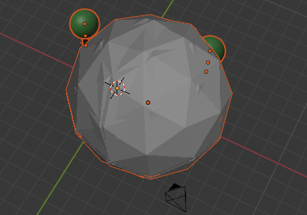
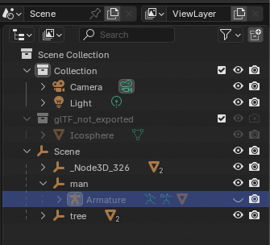

# Blender Armature "Golfball" Workaround

## Problem

When importing exported `.glb` files (for example Mixamo or Meshy characters) into Blender, the character can look like a "golfball" or dense sphere around the rig.

In most cases this is a viewport display issue for the armature (rig visualization), not broken mesh geometry.

Example of the issue ("golfball" armature display):



Example after workaround (armature hidden in Outliner):



## What This Means

- Pose and animation data are usually still valid.
- The issue is mostly visual noise from armature display mode in Blender.
- Forge exports should keep the rig for stable pose/animation workflows.

## Option A: Manual Fix In Blender (Recommended)

1. Import your `.glb` in Blender.
2. In Outliner, select the `Armature` object.
3. Either:
   - hide it with the eye icon, or
   - open `Object Data Properties` -> `Viewport Display` and set `Display As` to:
     - `Stick` (cleanest for most workflows), or
     - `Octahedral`.

## Option B: Script Helper (Batch-Friendly)

Forge provides a helper script:

- `tools/blender_armature_helper.py`

Examples:

```bash
# Import GLB, then set all armatures to STICK
blender --python tools/blender_armature_helper.py -- \
  --import "/ABS/PATH/model.glb" --display stick
```

```bash
# In current Blender scene: hide all armatures
blender --python tools/blender_armature_helper.py -- \
  --display hide
```

```bash
# Apply only to currently selected armatures
blender --python tools/blender_armature_helper.py -- \
  --display octahedral --target selected
```

## Notes For Mixamo / Meshy

- This affects Mixamo and Meshy rigs as well.
- Keep rig enabled when you need animation retargeting or timeline playback.
- Use the display workaround instead of removing rig data.
